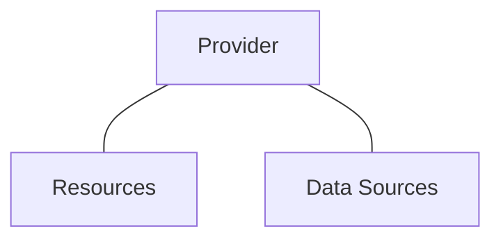

# HOL-2603-Terraform Hands-On Lab

> By Leo Cao, April 24, 2026


## 1. Install Terraform on Windows

### 1.1 Download Terraform for Windows

Download Terraform 1.14.9 from https://releases.hashicorp.com/terraform/1.14.9/terraform_1.14.9_windows_amd64.zip.

> Reference: https://developer.hashicorp.com/terraform/install


### 1.2 Install Terraform

Copy Terraform to Windows\System32


### 1.3 Install Terraform by winget on PowerShell (Optional)

```
winget install HashiCorp.Terraform
```

## 2. Initial Terraform

### 2.1 Create Terraform provider for AWS

a) Declare AWS provider on Terraform main.tf

```terraform
provider "aws" {
    region = "ap-northeast-1"
    access_key = "REPLACE AS YOUR AWS ACCESS KEY"
    secret_key = "REPLACE AS YOUR AWS SECRET KEY"
}

# Configure the TencentCloud Provider
provider "tencentcloud" {
  secret_id  = "my-secret-id"
  secret_key = "my-secret-key"
  region     = "ap-guangzhou"
}
```

> **⚠️ WARNING!** 
>
> Hard-coded credentials are not recommended in any Terraform configuration and risks secret leakage should this file ever be committed to a public version control system
>
> Reference: https://registry.terraform.io/providers/hashicorp/aws/latest/docs

Edit `providers.tf` below:

```terraform
terraform {
  required_providers {
    aws = {
      source  = "hashicorp/aws"
      version = "6.42.0"
    }
  
    tencentcloud = {
      source  = "tencentcloudstack/tencentcloud"
      version = "1.82.89"
    }
  }
}
```

> **⚠️ WARNING!** 
>
> Hashicoro official providers doesn't need providers.tf, but others need providers.tf.

b) Run `terraform init`

```Shell
terraform init
```


## 3. Terraform Operations

Terraform Provider components.



## 3.1 Create Terraform Providers, Resources and data Sources.

a) Create `resource` by updating `main.tf` below:

```terraform
provider "aws" {
    region = "ap-northeast-1"
    access_key = "REPLACE AS YOUR AWS ACCESS KEY"
    secret_key = "REPLACE AS YOUR AWS SECRET KEY"
}

resource "aws_vpc" "dev-vpc" {
  cidr_block = "10.1.0.0/16"

}

resource "aws_subnet" "dev-subnet-1" {
  vpc_id = aws_vpc.dev-vpc.id
  cidr_block = "10.1.10.0/24"
  availability_zone = "ap-northeast-1a"

```

> Reference: https://registry.terraform.io/providers/hashicorp/aws/latest/docs/resources/default_network_acl

Apply Terraform

```Shell
terraform apply	
```

Type`yes` after verifying Terraform plan.


Verify whether Terraform created `vpc` and `subnet`.


b) Create `data` by updating `main.tf` below:

```Terraform
provider "aws" {
    region = "ap-northeast-1"
    access_key = "REPLACE AS YOUR AWS ACCESS KEY"
    secret_key = "REPLACE AS YOUR AWS SECRET KEY"
}

resource "aws_vpc" "dev-vpc" {
  cidr_block = "10.1.0.0/16"
}

resource "aws_subnet" "dev-subnet-1" {
  vpc_id = aws_vpc.dev-vpc.id
  cidr_block = "10.1.10.0/24"
  availability_zone = "ap-northeast-1a"
}

data "aws_vpc" "exist_vpc" {
  default = true
}

resource "aws_subnet" "dev-subnet-2" {
  vpc_id = data.aws_vpc.exist_vpc.id
  cidr_block = "172.31.10.0/24"
  availability_zone = "ap-northeast-1a"
}
```

>**ℹ️ INFOMRATION**
>
>Add `data.` for reciting data. For example: `vpc_id = data.aws_vpc.exist_vpc.id`

> **⚠️ WRAMING!** 
>
> The new VPC and Subnet cannot be an existing ones, it needs to verify on AWS carefully before create it on Terraform.

Apply Terraform, then check terraform plan and type `yes` to create AWS subnet `dev-subnet-2`

```Shell
terraform apply
```

Last, verify subnet `dev-subnet-2` on AWS.

## 3.2 Modify Terraform Expectations


a) Add Tags `Name` and `vpc_env` by updating `main.tf1` as below:

```terraform
provider "aws" {
    region = "ap-northeast-1"
    access_key = "REPLACE AS YOUR AWS ACCESS KEY"
    secret_key = "REPLACE AS YOUR AWS SECRET KEY"
}

# Configure the TencentCloud Provider
provider "tencentcloud" {
  secret_id  = "my-secret-id"
  secret_key = "my-secret-key"
  region     = "ap-guangzhou"
}

resource "aws_vpc" "dev-vpc" {
  cidr_block = "10.1.0.0/16"
  tags ={
    vpc_env = "dev"
    Name = "devepment"
  }
}

resource "aws_subnet" "dev-subnet-1" {
  vpc_id = aws_vpc.dev-vpc.id
  cidr_block = "10.1.10.0/24"
  availability_zone = "ap-northeast-1a"
  tags = {
    Name = "subnet-dev-1"
  }
}

data "aws_vpc" "exist_vpc" {
  default = true
}

resource "aws_subnet" "dev-subnet-2" {
  vpc_id = data.aws_vpc.exist_vpc.id
  cidr_block = "172.31.50.0/24"
  availability_zone = "ap-northeast-1a"
  tags = {
    Name = "subnet-default-2"
  }
}
```

b) Apply Terraform, verify terraform plan and type `yes` to continue.

```Shell
terraform apply
```


c) Verify tags on AWS.


d) Remove tags in `main.tf`

Remove ` vpc_env = "dev"` in `main.tf`, save and run `terraform apply`, last verify it on AWS.


e) Remove `data` and `resource` 

**Optional 1 (Recommended):** Remove `data` and `resource` in main.tf and run `terraform apply`

**Optional 2:** Terraform destroys specific resource.

> **⚠️ WARMING!** 
>
> The destroy command is not a best practice.

```Shell
terraform destroy -target aws_subnet.dev-subnet-2
```


## 3.3 Terraform Operations


a) Compare Terraform expectations and existing configurations.

```Shell
terraform plan
```
